# 材料结构与性能 · 复习大纲

> 这份大纲是我在复习阶段自己整理的：把两份讲义的内容按层次压缩成提纲，用来替代"逐章抄笔记"。
> 整理思路：详细笔记太费时间，而且做完后面的会忘掉前面的；改成按层次提炼要点后，既能快速过一遍，也方便反复回看。
> 说明：文中个别处保留了整理时的简记（例如"没找到"指当时没在课件里找到对应内容），并非笔误。

---

# 第一部分 · 结构基础与六类性能

## 第一章 原子与晶体

### 一、了解原子核外电子怎么排布的（图不用死记）

高中知识，略

会写排布式即可

### 二、了解电子在不同能级间跃迁发射光频率/波长计算

没找到

### 三、了解化学键：共价键、金属键、离子键、氢键、范德华力，以及对应的典型材料

#### 1、共价键与原子晶体

- **（1）特点**

靠共用电子对形成共价键，使得电子云能最大限度重叠，具有方向性和饱和性

- **（2）分子轨道理论**

两能级相近的原子轨道组合成为分子轨道时，能级高于原子轨道的叫反键轨道（上有反键电子），能级低于原子轨道的叫成键轨道（上有成键电子）

按键轴分布特点，可分为轨道、轨道、轨道

- **（3）共价半径和共价键长**

共价半径：以共价单键键合的两相同原子间距的一半

变化规律：同周期，从左向右半径减小；同族，从上向下半径增大

- **（4）原子晶体**

由强烈的共价键结合而成的具有空间网状组织结构的晶体

整体是大分子，化学式是各原子数目最简整数比

具有较高的熔点、沸点和硬度

- **（5）实例**

非金属单质：金刚石、硅、硼、锗

非金属氧化物：二氧化硅、碳化硅、氮化硼

金属氧化物：氧化铝

石墨和石墨烯不是原子晶体

#### 2、金属键

- **（1）金属键导致的金属特性**

不透明、金属光泽、良好的导电性、良好的导热性、良好的延展性（塑性）、密度较高（原子紧密排列）、电阻具有正温度系数

- **（2）金属键的成因**

金属原子的最外层电子易脱离成为自由电子，为所有正离子共有，整个晶体靠正离子和自由电子之间的吸引力结合而成

- **（3）金属键特点：电子共有、无饱和性、无方向性**

- **（4）自由电子理论**

假设：

凝胶模型：忽略电子和离子实之间的作用，将离子实看作是保持体系电中性的均匀正电荷（背景：自由电子近似）

独立电子近似：忽略电子间相互作用

理论求解：令电子在该三维势阱中的势能为0，进行求解

可解释现象：

电阻正温度系数：温度上升，原子的热运动剧烈，阻碍了自由电子传导电流，使得电阻上升

延展性（塑性）：金属键无方向性，延展后不会破坏正负离子间结合，金属键不会被破坏

银白色：金属内的自由电子容易吸收频率在其截止频率以上的光，进而跃迁放出光子，从而使得其呈现出银白色

高热导：金属原子和自由电子很容易以振动传导热量

#### 3、离子键

- **（1）实质：正负离子间静电引力**

- **（2）特点**

无饱和性、无方向性

- **（3）决定离子晶体结构之因素：正负离子电荷量、半径、堆积密度**

- **（4）离子晶体特点**

有较高的配位数

良好的绝缘体（难以产生自由电子，实例：云母）

光学特性：自由电子被束缚而难以激发，从而不吸收可见光，使得离子晶体无色透明

力学特性：硬度大、难压缩、脆（离子晶体滑移时，容易引起同号离子相斥而破碎）

熔沸点高，难挥发，易溶于极性溶剂

#### 4、氢键

- **（1）实质：强极性键上的氢离子与电负性较大、含孤电子对且具有部分负电荷的原子间的吸引力**

- **（2）特点**

饱和性：氢原子只能与一个原子结合形成氢键

方向性：在可能范围内，氢键方向与孤对电子的对称轴方向一致

- **（3）对性能的影响**

熔沸点：

分子间氢键：使得熔沸点升高

分子内氢键：使得熔沸点降低

黏度和表面张力：分子间氢键使得其升高（水表面张力大来源于此）

- **（4）水与冰**

物理性质：

密度：冰熔化时，空旷的氢键瓦解，使得密度变大，另一方面，又有反常膨胀

冰升华热大：需要破坏所有的氢键

冰熔化热小：只需破坏15%的氢键，熔化热小

水介电常数大（由于具有极性）、黏度和表面张力大

冰的结构：

最常见：六角结构的Ih相

内部H原子无序分布

冰的熔化：断裂15%的氢键，环化为五角十二面体为主的多面体体系

#### 5、范德华力

- **（1）含义：分子间作用力时除了共价键、离子键、金属键之外基团和分子间相互作用力的总称**

- **（2）特点**

没有方向性和饱和性（显然）

反比于距离的七次幂

作用力弱

注：共价键、氢键有饱和性和方向性；金属键、离子键和范德华力没有饱和性和方向性

- **（3）分类**

取向力：

极性分子之间固有偶极间的静电引力

存在于极性分子与极性分子之间

诱导力：

极性分子和极性分子或非极性分子之间，由于极性分子破坏电荷重叠而产生诱导偶极所产生的极性分子与诱导偶极之间的作用力

极化率：用于表征分子中的电子在电场作用下离域的程度（显然）

存在于极性分子与非极性分子或极性分子与极性分子之间

色散力：

在某一瞬间，正负电荷中心可能分离，产生的瞬时偶极之间的作用力

显然，变形量越大、电离能越低，色散力越大

无论何种分子均存在

- **（4）范德华半径**

含义：分子间相邻但不成键的原子靠近到排斥力与范德华力相等时原子间距的一半

范德华半径和：E-r曲线最低点对应距离

- **（5）对物性的影响**

对同系物或组成结构相似的分子：

熔沸点随分子量增大而升高（例：卤素、惰性气体、碳族氢化物）

极化率随分子增大而增大

相对分子量相同，极性大，则范德华力大

- **（6）分子晶体**

含义：分子间通过分子间作用力构成的晶体

例：非金属氢化物、大部分非金属单质、部分非金属氧化物、几乎所有酸、绝大多数有机化合物

### 四、物质熔点、沸点、导电性、弹性模量、热膨胀等参数与化学键的关联

#### 1、熔点

键强的物质熔点较高

共价键、离子键化合物熔点较高（纯共价键的金刚石熔点最高，金属相对较低）

沸点同理

#### 2、材料密度

金属键无方向性，趋向于让金属原子紧密排列，使得金属密度高

共价键有饱和性和方向性，离子键有饱和性，原子排列欠致密

#### 3、弹性模量

结合键能越强，使得原子移动需要的外力越大，弹性模量越高

还与结构因素有关

#### 4、导电性

金属键物质：导电

离子键物质：常温绝缘，熔体导电

共价键、范德华力、氢键物质：一般绝缘，导电性还与内部结构有关

#### 5、热膨胀系数

键强度高的，势阱深、势能曲线对称性好，使得原子间距离增加困难，热膨胀系数低，甚至负膨胀

#### 6、热导率

晶体结构越简单，化学键越强，振动简谐程度越高，平均自由程越大，热导率越高

### 五、从能带理论区分导体、半导体和绝缘体

#### 1、能带的形成

- **（1）原子形成晶体时，能级相近的各能级的原子轨道重叠，最外层原子轨道重叠程度最大、电子共有化最显著**

- **（2）电子在周期性的势场中运动（势能函数不取0，而认为在周期性变化）**

- **（3）求解薛定谔方程形成N个分子轨道，而N数值极大，各能级差距极小，由此形成能带**

#### 2、能带相关概念

- **（1）轨道重叠多的价层原子轨道形成的能带较宽（理解：轨道重叠多，使得电子可能处于的状态多，能带较宽）**

- **（2）费米能级：在0K条件下电子能占据的最高能级**

- **（3）诸概念**

能带：在允许电子存在的范围内准连续分布的电子能级

禁带：各能带之间的间隔，宽度以表示

满带：全部能级被填充的能带

空带：全部能级都未被填充的能带

价带：相应价电子填充的能带（研究半导体和绝缘体时，认为是0K下被电子占据的最高能带）

导带：固体结构中自由运动的电子所具有的能量范围

#### 3、区分导体、半导体、绝缘体

金属：所有的价电子均处于导带（价带和导带重叠）

绝缘体：

半导体：

### 六、范德华力的起源：见上

### 七、晶向指数、晶面指数

#### 1、晶向指数

晶向指数用表示

#### 2、晶向族：原子排列情况相同但空间位向不同的一组晶相（做题时具体列出来）

晶向族用表示

#### 3、晶面指数

注意是截距的倒数再互质

晶面指数用表示

特别地，对于六方晶系，用表示，其中，

实际应用理解：先定a1、a2轴，再定c轴

#### 4、晶面间距

立方晶系：

六方晶系：

正交晶系：

#### 5、晶面族：晶面间距、原子排列情况完全相同的晶面

晶面族用表示

### 八、对称操作和对称元素（宏观、微观）、基本对称操作（基础理解）

#### 1、宏观对称操作：旋转、反映、反演、旋转反演

#### 2、微观对称操作：平移、螺旋旋转、滑移反映

### 九、理解点群、空间群的由来；7晶系和14种布拉菲格子的差别

#### 1、点群、空间群的由来：对称操作

#### 2、7种晶系和14种布拉菲格子

低级晶系：三斜晶系、单斜晶系、正交晶系

中级晶系：四方晶系（一面正方形的长方体）、三方晶系、六方晶系

高级晶系：立方晶系

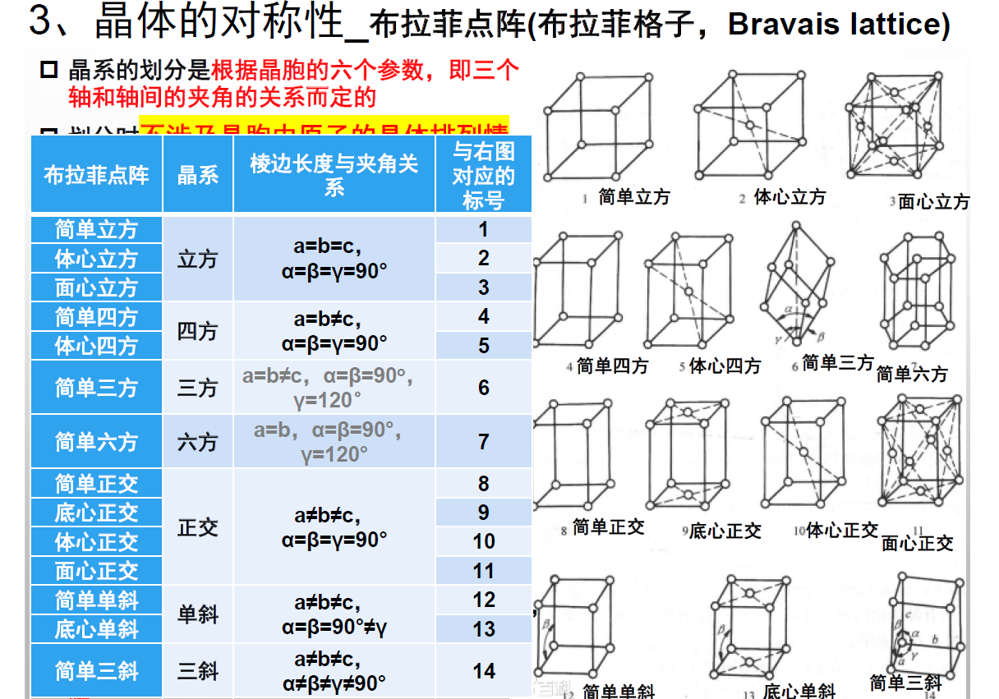

### 十、缺陷

#### 1、点缺陷

- **（1）热缺陷**

Frenkel缺陷：原有位置有空位而无间隙原子

Schottky缺陷：原有位置有空位且有间隙原子

热缺陷密度随温度指数变化

- **（2）杂质缺陷**

#### 2、线缺陷

- **（1）刃型位错**

- **（2）螺型位错**

- **（3）位错的运动**

滑移：沿着滑移面运动，运动方向与Burgers矢量平行

攀移：认为是半原子面进一步插入或抽出（需要能量更大）

#### 3、面缺陷

- **（1）晶界：晶粒间的交界过渡区**

分类：小角度、大角度

- **（2）孪晶界**

孪晶：两晶体沿一个公共晶面构成镜像对称的位置关系

孪晶界分类：共格、非共格

- **（3）相界**

含义：不同结构与性质的两相之间的界面

分类：共格、半共格、非共格

### 十一、密堆积、最密堆积、致密度

#### 1、最密堆积

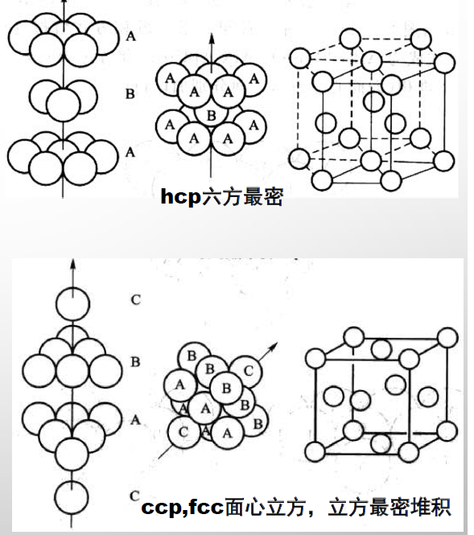

还有其他的最密堆积方式，且略

#### 2、密堆积（不是最密堆积）

例：体心立方

#### 3、几何关系：易算，且略

#### 4、配位数和致密度

- **（1）配位数计算：别漏了**

- **（2）致密度**

最密堆积的致密度均相等，可以利用面心立方进行计算（74%）

简单立方（52%）和体心立方（68%）也均可以算

### 十一、八面体、四面体间隙（这部分要背下来）

#### 1、最密堆积情况（看面心立方）

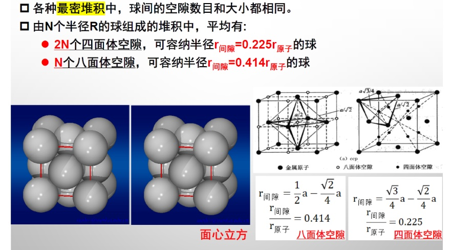

空隙数量可以直接数，间隙半径利用几何关系计算

或者记：

八面体

四面体

#### 2、体心立方堆积情况

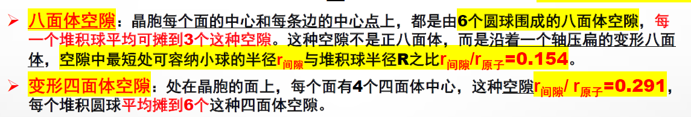

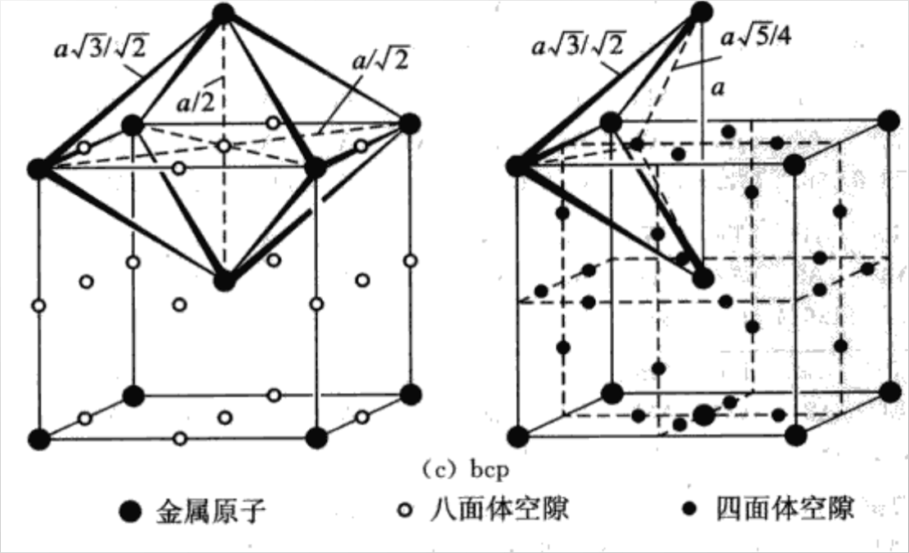

八面体间隙：平均每个晶胞6个

四面体间隙：平均每个晶胞12个

## 第三章 材料结构与力学性能

### 一、应力，应变（真实、名义）、弹性模量、泊松比、蠕变……（概念、计算）

### 二、弹性形变机制

#### 1、微观本质：构成物质的质点在平衡位置附近产生的微小位移

#### 2、注意势能的展开

### 三、复合材料的弹性模量

#### 1、上限和下限

#### 2、带有气孔的情况：当作0

#### 3、温度上升，E近似线性下降；相变会影响；固溶体具体问题具体分析；若合金中有过渡族组元，则E值不成线性变化

### 四、塑性形变与晶格滑移、位错运动理论、塑性影响因素

#### 1、单晶：有晶格滑移和孪晶（突变和连续）

#### 2、滑移线和滑移带，滑移系（滑移面和滑移方向），滑移因素（Burgers矢量要小（最密排面上最密排方向）、化学键），切应力大于临界发生滑移

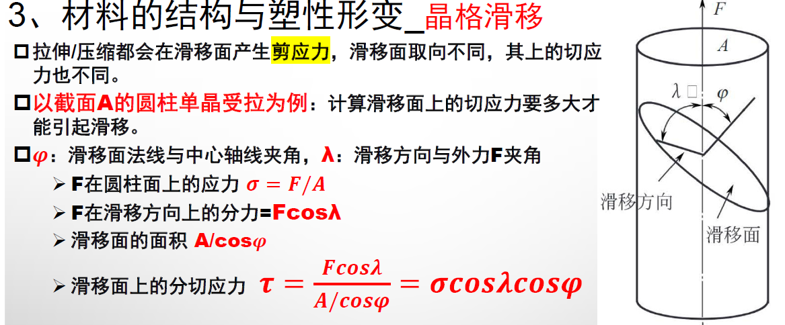

#### 3、滑移实质（位错的运动），位错的激活能（存在刃型位错+外力作用使得原子能越过势垒），保持运动速度的力（位错运动速度随温度上升而上升，原本常温下无塑性形变的材料在高温下具有塑性）

#### 4、影响因素：

- **（0）一般影响因素：**

位错运动速率、可动位错密度、Burgers矢量、位错增殖系数；

微观组织结构等的影响（表面缺陷密度、杂质原子）

- **（1）金属——多晶材料**

每一个晶粒都与单晶规律相同；

多晶的塑性变形的抵抗能力比单晶高；

具有不同时性和不均匀性；

具有相互协调性；

位错滑移在晶界受阻，使得晶界处变形较于内部变形小，整个晶粒变形不均匀，但温度升高后晶界不稳定，强化作用减弱；

- **（2）陶瓷**

滑移系统少、滑移系统大量作用、存在大量晶界导致缺乏塑性

键合类型：共价和离子：滑移需要破坏大量有方向性的键，较困难；有静电阻力

晶界：使得滑移容易传播，外力作用下未产生位错即断裂

不易形成位错

- **（3）超塑性**

金属：结构超塑性（有微细等轴晶粒组织）和相变超塑性（多次循环相变或同素异形转变获得大延伸）

陶瓷：适当的组织和变形条件；主要影响因素：内在：晶粒尺寸和晶界性质；外在：变形温度和应变速率

总：晶粒小+适当的温度条件

### 五、蠕变

#### 1、含义：在高温下长时间承受温度和恒定载荷作用而缓慢塑性变形的现象

#### 2、阶段：减速、恒速、加速

#### 3、机制

- **（1）位错滑移与攀移**

攀移：刃型位错垂直于滑移面方向的运动，需要热激活

攀移后可绕过障碍，从而使得滑移面滑移

- **（2）扩散蠕变：高温下大量原子和空位定向移动，由应力应发**

- **（3）晶界滑动**

高温和力作用下晶界上原子易扩散导致滑动

金属：晶界的滑动易于在晶界上产生裂纹

陶瓷：加入晶界玻璃相使得致密化

### 六、理论强度；微裂纹理论；奥罗万修正；断裂韧性；增韧补强（理解、简单公式计算）

#### 1、断裂分类

- **（1）按时间：瞬时和延迟断裂**

- **（2）按宏观变形程度：韧性和脆性断裂**

韧性：

有明显缩颈现象

宏观：杯锥状；微观：韧窝状

脆性：塑性形变极小或不产生

- **（3）按裂纹扩展路径：穿晶断裂、沿晶断裂、解理断裂**

沿晶断裂：

晶粒粗大：石块、冰糖状断口；晶粒较小：结晶状

与解理断裂相比，反光能力差，颜色黯淡

金属材料在长时间高温载荷作用下大多为此种

穿晶断裂：

晶粒内部有位错气孔或其他缺陷，主裂纹沿着晶粒内部扩展

解理断裂：

沿着一定的晶面（解理面）劈开的断裂形式

#### 2、固体材料的理论强度

- **（1）理论断裂强度**

其中，E为弹性模量，gamma为形成新表面的表面能，a为晶格常数

- **（2）裂纹尖端应力集中问题**

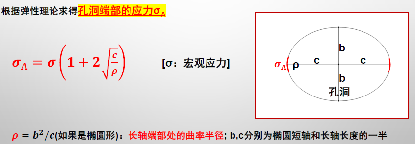

- **（3）微裂纹理论**

成因：存在缺陷、机械损伤或腐蚀、热应力

结论：

无限大薄板，即平面应力状态下材料的断裂强度：

无限大厚板，即平面应变状态下材料的断裂强度：

其中，c为内裂纹半长，mu为Poisson Ratio

平面应力：只在平面内有应力，与该面垂直方向的应力可忽略，例如薄板拉压问题。

平面应变：只在平面内有应变，与该面垂直方向应变可忽略。

- **（4）Orowan修正**

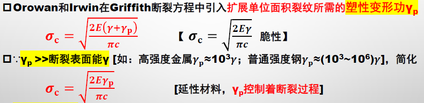

#### 3、断裂韧性

#### 4、增韧补强

- **（1）断裂强度角度**

减小裂纹尺寸或改变裂纹尖端应力状态为压应力以抑制其扩展

- **（2）断裂韧性角度**

提高断裂表面能或塑性功以增加裂纹扩展阻力

- **（3）显微结构角度**

晶粒越小，初始裂纹尺寸越小，强度得到提高

提高晶界玻璃相的软化点、改变晶界相性质

气孔也存在影响

- **（4）试样的尺寸和表面粗糙度**

尺寸越大、含有临界危险裂纹概率越大，断裂强度偏低

表面越光滑、缺陷越少

- **（5）应力状态角度**

预加压应力，进行热韧化

- **（6）加载速率**

既存裂纹等缺陷扩展有一定的响应时间，即滞后性，加载速率越高，裂纹扩展越来不及响应，即对缺陷的敏感性降低

- **（7）温度**

#### 5、陶瓷的增韧

- **（1）纤维补强增韧陶瓷基复合材料**

- **（2）复相陶瓷材料**

- **（3）自增韧陶瓷材料**

- **（4）叠层复合材料**

- **（5）陶瓷的晶界应力设计**

- **（6）功能梯度材料**

- **（7）纳米陶瓷材料**

- **（8）应力诱导相变增韧（相变增韧）**

- **（9）微裂纹增韧**

- **（10）裂纹偏转增韧**

- **（11）裂纹桥联**

- **（12）纤维的拔出效应**

本章可能的计算题

## 第四章 材料结构与热学性能

### 一、热容：理解爱因斯坦模型和德拜模型的差异

#### 0、杜隆-珀蒂定律及柯普定律

杜隆-珀蒂定律：恒压下元素的原子热容为

柯普定律：化合物热容等于构成化合物各元素原子热容之和

#### 1、爱因斯坦模型

假设：每个原子都是独立的振子，彼此无关，但是振动频率均为

结论：

当温度远大于温度时，近似于杜隆-珀蒂定律结论

当温度远小于温度时，以指数规律变化，不符合实验结论（以规律变化）

#### 2、德拜模型

假设：晶体是连续介质，在低温时，波长较长的声频支对热容的贡献占主导

结论：

当温度远大于温度时，近似于杜隆-珀蒂定律结论

当温度远小于温度时，符合实验结论（以规律变化）

取决于材料的结合强度、弹性模量和熔点

### 二、热膨胀：机制，影响因素

#### 1、膨胀系数

线膨胀系数

体膨胀系数

一般，（证：对V进行展开，忽略高阶小量）

膨胀系数是温度的函数，一般取指定温度范围内的平均值

#### 2、热膨胀机制

- **（1）本质：点阵结构中质点的平均距离随温度升高而增大**

- **（2）合力曲线与势能曲线：在平衡位置处斜率不对称，温度上升，平衡位置右移**

#### 3、影响因素

- **（1）键合**

键强度高的材料，热膨胀系数低

原因：键强度高、势阱深、曲线对称性越好，则膨胀系数越小，甚至负膨胀

体现：键强度高，则结合能强、熔点高

- **（2）晶体的各向异性和晶轴**

立方晶系物质的热膨胀系数在各个方向上相同（具有各向同性）

非立方晶系的物质在不同晶向上有不同的热膨胀系数

多晶材料会存在着微晶的择优取向，一定程度上体现出各向异性，从而影响热膨胀系数

- **（3）晶体与非晶体**

紧密堆积的结构热膨胀系数较大，而无定形的（如玻璃）则较小

原因：非晶态结构疏松存在空隙，当膨胀时，内部空隙被挤压，宏观上膨胀较少

- **（4）相变**

相变时晶体形态体积会变化，从而影响了膨胀系数

### 三、气体、液体、金属、无机非热传导机制

#### 1、气体与液体：载体是随机运动的分子或原子，通过相互碰撞实现热的传导

#### 2、金属晶体：载体是自由电子，自由电子质量轻，能迅速地实现热量的传递，使得金属一般有较大的热导率

#### 3、无机非金属固体：靠晶格振动的格波（声子、光子）及自由电子的运动（看情况）实现热导

### 四、声子热导、光子热导的物理理解及具体材料体系的分析

#### 1、声子热导

- **（1）概论：**

温度不太高时，导热过程主要有声频支格波贡献

声子：晶格振动的能量振子，是晶格振动能量变化的最小单元

将格波的传播看作是质点-声子的运动

将晶体热传导看作是非简谐弹性波在连续介质中的传播，或称声子碰撞的结果

- **（2）声子热导机制**

声子热导率与声子的平均自由程成正比

若振动为严格的线性振动，则各质点独立地作简谐振动，格波间无互相作用，声子不会发生相互碰撞，热阻为0，热量以声子速度在晶体内传播

实际情况下，热振动非线性、晶格间存在耦合，声子会碰撞导致平均自由程减小，热导率下降

- **（3）热阻的来源**

声子碰撞的散射是无机非晶体晶格中热阻的主要来源，缺陷、杂质、晶界也会引起格波散射

平均自由程与振动频率有关，波长长的容易绕过缺陷、散射小，热导率高

平均自由程与温度有关，温度上升，频率高、碰撞高，自由程下降，但平均自由程有一定限度（高温时：最小平均自由程等于几个晶格间距；低温：最长的达晶粒尺度）

#### 2、光子热导

- **（1）含义：热量传递由电磁辐射能引起，通过光子进行热传导**

- **（2）电磁辐射能量：与温度四次方成正比**

- **（3）光子热导的辐射传热过程**

热稳定时，辐射能量与吸收能量相等

有温度梯度时，温度高的体积元辐射能量大、吸收能量小

- **（4）光子热导率与平均自由程**

成正比

对于辐射线透明的介质，热阻小，平均自由程大；对于辐射线完全不透明的物质，辐射传热可忽略

大多数单晶和玻璃对于辐射线比较透明，大多数烧结陶瓷材料是半透明或透明度差

吸收和散射影响也很重要：吸收系数小的透明材料：光辐射是主要；吸收系数大的不透明材料：高温时光子传导也不重要

#### 3、自由电子热导：同上金属部分

### 五、结构与热导关系

#### 1、温度

- **（1）气体：热导随温度升高而增大（理解：温度高时碰撞剧烈，更容易通过碰撞导热）**

- **（2）无机陶瓷或其他绝缘材料：室温：随温度上升而减小（理解：温度上升，原子运动剧烈，声子更容易与原子碰撞，减小了平均自由程）；高温：随温度上升而上升（理解：光子热导得到加强）**

- **（3）半导体：随温度升高而显著增大（原因：高温下进入导带，自由电子可以导热）**

- **（4）多数金属材料：随温度上升缓慢下降（可认为是原子阻碍了电子热导）**

- **（5）高分子：热导很低**

- **（6）实例：氧化铝单晶**

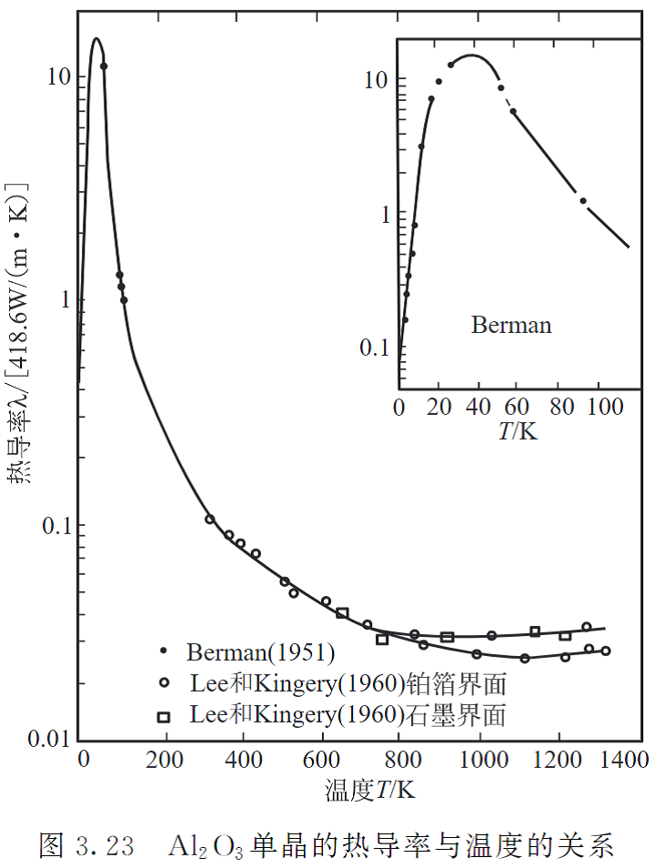

低温：声子平均自由程约为晶粒大小，热导与T立方成正比

升高：平均自由程减小，但在40K出现极大值

再升：声子平均自由程下限：晶格尺寸，热导和1/T成正比而下降

高温：受光子导热影响，热导有所回升

#### 2、原子质量

相对原子质量越低、德拜温度越大，热导率越大（理解：与轻原子碰撞时损失少）

轻元素和结合能大的固体热导率大（理解：结合能大、振动简谐性好）

#### 3、显微结构

- **（1）晶体结构**

晶体结构越简单，化学键越强，振动简谐程度越高，平均自由程越大，热导率越高

- **（2）晶体各向异性**

膨胀系数低的方向热导率高（原因同上）

- **（3）单晶和多晶**

晶界、位错、点缺陷等缺陷对于格波有散射作用，降低了热导，且高温下对声子阻碍作用更显著

- **（4）复合材料、复相材料、第二相**

取决于数量排列和各自热导率

有类似于电阻串并联的结论

- **（5）气孔**

微小气孔（不改变组织形态）：气孔率上升，热导率下降

大尺寸气孔：其方向和对热辐射的影响也会影响热导

例：气凝胶

- **（6）非晶体**

声子平均自由程基本是常数，随温度上升，热导上升不大，高温时，受光子热导影响，热导上升

### 六、抗热震性的物理意义

#### 1、表示

- **（1）含义：承受温度剧烈变化而不致破坏的能力**

- **（2）类型**

抵抗温度急剧变化而瞬时断裂的能力：抗热冲击断裂性

抵抗热冲击循环作用而损伤的能力：抗热冲击损伤性

#### 2、评定方法：略

#### 3、热应力

- **（0）含义：由于材料热胀冷缩而引起的热应力**

- **（1）热胀冷缩受到限制而导致的热应力**

- **（2）温度梯度导致的热应力**

- **（3）多相复合材料因膨胀系数不同而导致的热应力**

#### 4、抗热冲击断裂性的表征

- **（1）第一热应力断裂抵抗因子**

只考虑最大温差

- **（2）第二热应力断裂抵抗因子**

考虑热导性、传热与散热

- **（3）第三热应力端粒抵抗因子**

考虑冷却速率、温度梯度

#### 5、抗热冲击损伤性

正比于断裂表面能，反比于应变能释放率

#### 6、材料结构与抗热震性

- **（1）材料结构与相组成**

- **（2）显微结构组织**

晶粒尺寸和形态

气孔和微裂纹

增强纤维的形态与排布、编织方式

本章可能的计算题

## 第五章 材料结构磁学性能

### 一、原子尺度磁性的起源

#### 1、原子核磁矩：极小，可忽略

#### 2、电子轨道运动磁矩：在晶体（大尺度情况）中，电子轨道运动磁矩互相抵消

#### 3、电子自旋磁矩

物质的磁性主要由电子自旋磁矩引起

永久磁矩来自于系统中的不成对电子，未成对电子是物质具有磁性的必要条件（还取决于晶体结构）

### 二、理解八面体配位场中，高、低自旋型下电子轨道填充情况

### 三、磁矩角度理解抗磁性、顺磁性、铁磁性、亚铁磁性、反铁磁性

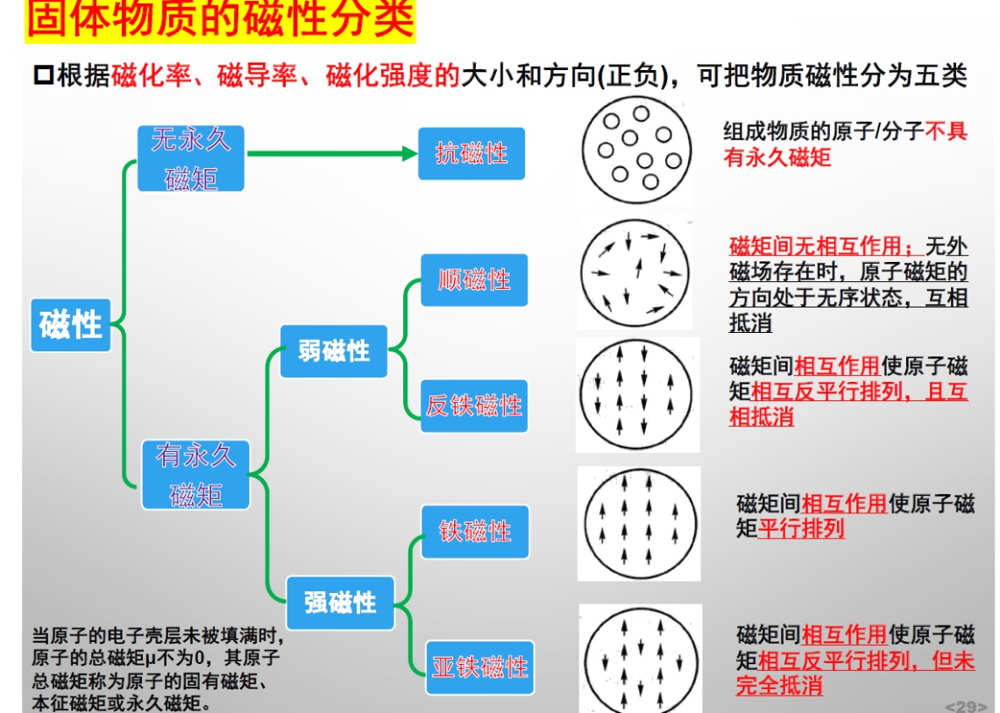

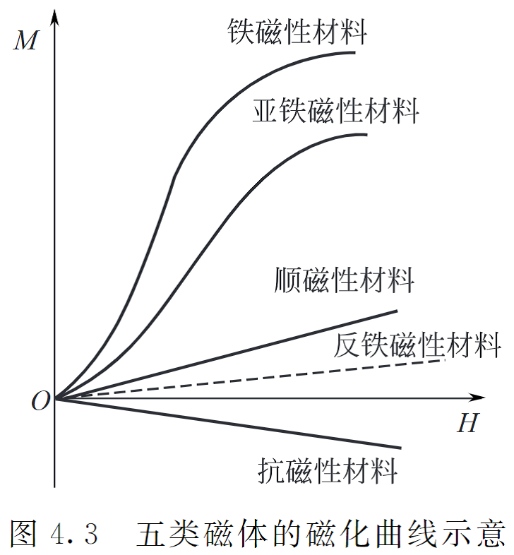

#### 1、顺磁性（核心：原子磁矩间无相互作用）

- **（1）定量**

在外磁场作用下会受其影响，产生相同方向的磁场

- **（2）特点**

有永久磁矩（有未填满的电子壳层或有未成对电子）

原子磁矩间无相互作用

- **（3）磁场响应：**

无磁场时，由于热扰动，不表现宏观磁性

有外磁场作用时，原子磁矩转向外磁场方向（受热运动影响，较难；降低温度可以提升磁化率）

#### 2、抗磁性

- **（1）定量**

- **（2）特点**

不存在永久磁矩，电子壳层被充满

在外磁场作用下，会被诱导产生与外磁场方向相反的磁矩，显示出抗磁性

磁化率与温度无关

- **（3）物质的抗磁性**

原子壳层满电子，无未成对电子

自旋磁矩、轨道磁矩抵消

在外加磁场中表现出诱导磁矩

任何具有满电子壳层的物质都有一定的抗磁性，但不一定显现出

#### 3、铁磁性

- **（1）定量**

- **（2）特点**

物质具有自发磁化现象（在无外加磁场作用下，各原子的磁矩一定程度上有序排列）

存在永久磁矩

磁矩间存在一定的交换作用

- **（3）磁场响应**

较弱磁场下就能体现出较大的磁化强度

外磁场增大时，磁化强度迅速达到饱和，磁化率变小

撤去外磁场后，仍可保留较大的磁化强度

- **（4）物质的铁磁性**

铁磁金属组成的合金：铁磁性

铁磁金属+非铁磁金属合金/非金属：一定范围有铁磁性

非铁磁金属合金：范围更窄

#### 4、反铁磁性

- **（1）定量**

- **（2）特点**

无外磁场时，邻近原子间相互作用使得电子自旋反向平行排列

晶胞内两个子晶格中自发磁化强度大小相等方向相反

- **（3）Neel温度TN**

反铁磁性变成顺磁性的温度（无相互作用）

#### 5、亚铁磁性

- **（1）定量：同上，略**

- **（2）特点**

两种子晶格上的反向磁矩未完全抵消的铁磁性

### 四、磁畴的产生

#### 1、含义：磁性材料内磁矩排列一致的原子组成的微区

#### 2、形成：受交换能、退磁能、畴壁能等因素影响

#### 3、畴壁：布洛赫壁（磁畴变化时与畴壁平面平行）、奈尔壁（磁畴变化时旋转）

### 五、抗磁性的起源

见上，核心为外磁场作用下抗磁性物质内部电子Larmor进动产生相反方向的诱导磁场

### 六、理解直接交换作用的物理意义

### 七、理解磁滞回线的物理意义

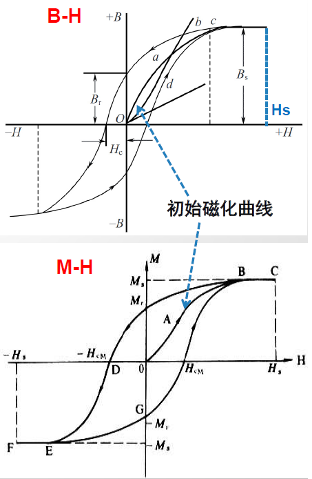

#### 1、含义：当外加磁场为交变磁场时，将磁化强度M或磁感应强度B随磁场H变化规律作图，即可得到闭合的磁滞回线

#### 2、重要概念

剩磁Br

矫顽力HC

饱和/剩余磁感应强度、饱和/剩余磁化强度

### 八、从晶体结构角度理解磁铁矿磁性的产生

​​1、晶体结构​​：​​反尖晶石结构​​

八面体间隙：32个（每个子晶格4个，8个子晶格）

四面体间隙：64个（每个子晶格8个，8个子晶格）

​​2、磁矩抵消机制​​：

A位（四面体）：Fe³⁺（↑5μB）

B位（八面体）：Fe³⁺（↓5μB） + Fe²⁺（↓4μB）

​​净磁矩​​ = |B位磁矩| - |A位磁矩| = (5+4) - 5 = ​​4μB/分子​​（实测≈4.2μB）。

## 第六章 材料结构与电导

### 一、理解名词：载流子、迁移率

#### 1、载流子

- **（1）含义：电荷的载体**

- **（2）电导：载流子远程迁移或协同运动达到远程迁移的效果而产生的**

- **（3）电导率**

#### 2、迁移率

其中，，称载流子的迁移率，意义为载流子在单位电场中的迁移速度

显然有

### 二、离子电导的产生（本征、杂质）

#### 0、离子电导概论

离子晶体的电导主要是离子电导

离子一般只在平衡位置上热振动

离子电导过程中，载流子为离子，传电和传质同时进行

条件：

一部分离子构成固定的三维骨架

骨架中有大量空隙，可让另一种离子无序地分布在其中

通道大小合适，可以使得导电离子穿行

#### 1、本征电导

- **（1）含义：由热缺陷产生**

- **（2）热缺陷**

Schottky：原子脱离原有位置，无间隙原子

Frenkel：原子脱离原有位置，成为间隙原子，有空位-间隙对

#### 2、杂质电导：由杂质粒子贡献

#### 3、离子电导电导率的影响因素

- **（1）载流子浓度**

低温：热缺陷较少，杂质解离能较低，在低温下电导由杂质载流子决定

高温：热缺陷较多，在高温下本征电导显著增大

- **（2）离子迁移率**

- **（3）温度**

电导率与温度呈指数关系，温度上升，电导率迅速上升

- **（4）晶体结构**

晶体结合力大，电导率小（显然）

晶体结合力大：离子半径小、离子电荷大、堆积紧密

- **（5）晶体缺陷**

晶格缺陷的生成和浓度是决定离子电导的关键之所在

### 三、从晶体结构角度，理解alpha-碘化银、 beta-氧化铝离子电导的产生

#### 1、alpha-碘化银

- **（1）I-体心立方堆积的空隙分布**

八面体间隙：分布在棱的中点和面心，每个晶胞有6个，平均每个I-摊到3个

四面体间隙：每个面上4个，每个晶胞中有12个，平均每个I-摊到6个

三角双锥间隙：每个晶胞共有24个，12个处在晶胞内部，另外的12个处在棱的位置上平均每个I-摊到12个

- **（2）银离子导电机制**

每个I-平均有21个空隙，空隙中心相隔很近

Ag+可占据的空隙数比Ag+数多很多

空隙相互共面连接，形成三维通道

在不大的电场下，银离子便可迁移导电

#### 2、beta-氧化铝

Beta-氧化铝有β和β"相：氧离子面心立方密堆积，铝离子占据八面体和四面体间隙。

由四层β-Al2O3或六层β"-Al2O3密堆积氧离子和铝离子构成的基块被称为尖晶石基块，尖晶石基块之间是由钠氧离子构成的疏松堆积的钠氧层。

通过尖晶石基块中的铝离子和钠氧层中的氧离子使尖晶石基块连接起来。钠离子可以在层间迁移。

### 四、电子电导（金属、半导体）物理机制，公式的物理意义

#### 1、金属

- **（1）电阻的产生**

电子和声子、杂质缺陷相碰撞而散射

- **（2）Matthiesen马基申定律**

其中，是声子引起的电阻率，是缺陷引起的电阻率

- **（3）结论：金属电阻率与温度近似成正比，温度越大电阻越大（正温度系数）**

#### 2、离域键与非金属导体

若分子中形成离域键，则有可能改变其导电性能（是必要条件）

实例：石墨、聚乙炔

### 五、从能带理论理解掺杂及N型、P型半导体

#### 1、能带理论：略，见前

#### 2、本征半导体

- **（1）未激发时，无法导电**

- **（2）激发后，价带半导体越过禁带到达导带，出现了导电电子和空穴。通过电子和空穴进行导电（电子逆电场运动、空穴顺电场运动，二者同时进行同时存在）。**

- **（3）载流子浓度：电子和空穴浓度相等，与温度呈指数关系，急变**

#### 3、半导体掺杂

- **（1）P型、N型**

- **（2）N型半导体导电机制**

掺杂导致多出电子，多余的电子能级离导带很近，比价带中的电子容易激发到导带。这种多余电子的杂质能级称为施主能级ED

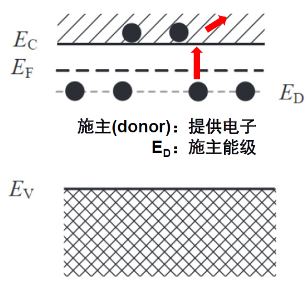

- **（3）P型半导体导电机制**

掺杂后导致电子减少而出现空穴能级，该空穴能级离价带很近，价带中电子激发至空穴能级上比起越过整个禁带到导带容易得多，这个空穴能级能容纳由价带激发上来的电子，故称这种杂质能级为受主能级EA（理解：所谓空穴能级，即为电子处于该空穴时的能级）

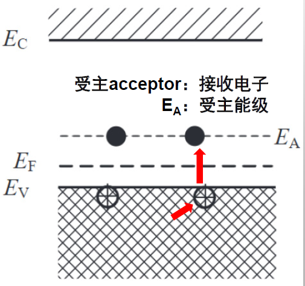

#### 4、本征半导体载流子浓度：随温度指数上升

#### 5、杂质半导体载流子浓度：随温度指数上升

#### 6、电子电导率

- **（0）概论**

影响因素：载流子浓度与迁移率

迁移率：取决于载流子散射

载流子为电子和空穴，导电是共同作用结果

- **（1）载流子散射**

晶格散射（声子散射）：温度上升，散射增加（显然）

电离杂质散射：

杂质电离后产生附加电势，影响载流子运动，是为载流子散射

掺杂浓度越高，杂质散射越强

温度越低，载流子运动越慢，杂质散射越强

- **（2）温度对迁移率的影响**

回顾：

晶格散射和电离杂质散射随温度变化趋势相反

迁移率随温度变化较小

- **（3）温度对载流子浓度影响**

影响很大，符合指数规律

低温阶段主要为杂质电导；高温阶段主要为本征电导

- **（4）温度对电导率影响**

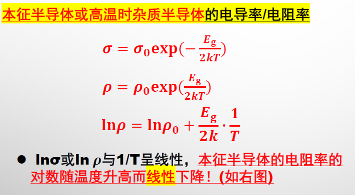

结论：高温时，随温度上升，电导率上升

实际情况比较复杂

### 六、计算（不用死记长公式）

## 第七章 材料结构与介电性能

### 一、极化与介电常数；影响因素

没找到

### 二、电极化的微观机制

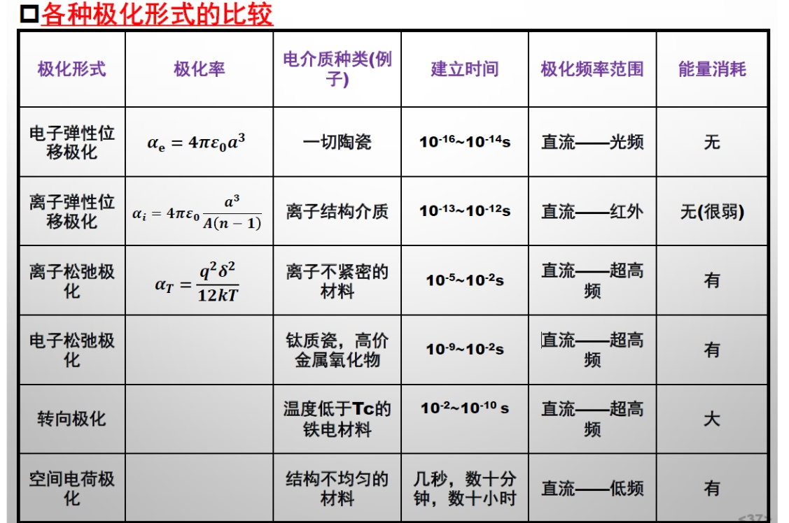

#### 1、电子（弹性）位移极化

- **（1）含义：电场作用下，电介质的电子云相对原子核发生位移, 从而感生出沿电场方向的感应偶极矩**

- **（2）特点**

主要是价电子发生位移

响应时间极短，频率可至光频，又称光频极化

任何电介质都会有电子位移极化

可逆，不消耗能量

- **（3）常研究模型：球状原子**

#### 2、离子（弹性）位移极化

- **（1）含义：在电场作用下，离子本身发生可逆的弹性位移**

- **（2）特点**

响应时间极短，频率相当于红外

不消耗能量

- **（3）定量分析**

离子位移极化率与正负离子半径和的立方成正比，与电子位移极化率有相仿数量级

#### 3、松弛极化

- **（1）强联系/弱联系离子**

强联系离子：离子处于格点平衡位置时能量最低，最稳定，离子牢固地束缚在格点上，称为强联系离子

弱联系离子：在非晶物质、结构松散的离子晶体中及晶体的杂质和缺陷区域，离子本身能量较高，易被活化迁移，称为弱联系离子

松弛质点：材料中弱联系的电子、离子和偶极子

- **（2）松弛极化**

电场作用下，松弛质点从一个平衡位置迁移至另一个平衡位置。当去掉外电场后，松弛质点不能回到原有平衡位置

- **（3）特点：不可逆、移动距离大、吸收一定的能量**

- **（4）离子松弛极化**

温度越高，极化率越低（热运动对质点运动有阻碍）

极化率比位移极化大数量级，介电常数较大

- **（5）电子松弛极化**

电子在一定条件的激发下能级发生改变，成为禁带中的局部能级，形成弱联系电子，在外加电场作用下被极化

电子松弛的极化具有一定的电导特性（显然）

#### 4、转向极化

- **（1）含义：在外电场作用下，介质内部的偶极子取向趋向于电场的方向**

- **（2）特点：能量消耗大**

#### 5、空间电荷极化

- **（1）含义：不均匀介质的空间电荷（可能在缺陷处）在电场作用下的积累**

- **（2）特点：高压极化，时间长**

### 三、理解多相材料介电常数的计算

#### 0、类比电容器

#### 1、两相并联

记两相体积/浓度分数，有

#### 2、两相串联

#### 3、两相混合分布

### 四、介电损耗的物理意义：且略

### 五、铁电、压电、热释电性物理意义，及其应用

#### 0、intro

线性介质：在外电场作用下，介质的极化强度与宏观电场E成正比

非线性介质：不成正比

自发极化：没有外加电场的情况下，内部电偶极子自发有序排列

铁电材料∈热释电材料∈压电材料∈介电材料

#### 1、铁电性

- **（1）含义：自发极化的非线性电介质在电场作用下自发极化方向随电场作用而转向**

- **（2）判据：自发极化+可重定向**

#### 2、热释电性

- **（1）含义：自发极化的电介质的极化状态随温度改变而变化**

- **（2）特点：所有呈现自发极化的晶体的共性（显然）**

#### 3、压电性

正压电性：力导致极化强度发生改变

逆压电性：电场作用下，晶体内部的正负电荷中心发生位移进而导致形变

### 六、从晶体对称性角度，理解可能存在铁电、压电、热释电的晶体结构

#### 0、共32种点群结构

#### 1、压电性：具有非中心对称结构的晶体才可能具有压电性（只有20种点群结构的晶体）

#### 2、热释电性：含有固有偶极矩的晶体叫极性晶体（其中10种），由于温度变化可引发电极化状态的改变

#### 3、铁电性：只有极化方向可在外电场作用下反转的热释电晶体

### 七、理解钙钛矿铁电体中铁电性的产生

Ba离子偏离氧八面体的运动位移常沿着3个高对称方向，故自发极化也沿着这三个方向之一

### 八、铁电滞回线的产生及物理意义

#### 1、intro

铁电畴（电畴）：铁电体内自发极化取向一致的电偶极子组成的微区

畴壁（铁电畴壁）

铁电畴不能任意取向，只能沿着晶体某一个特定晶相取向

#### 2、电滞回线

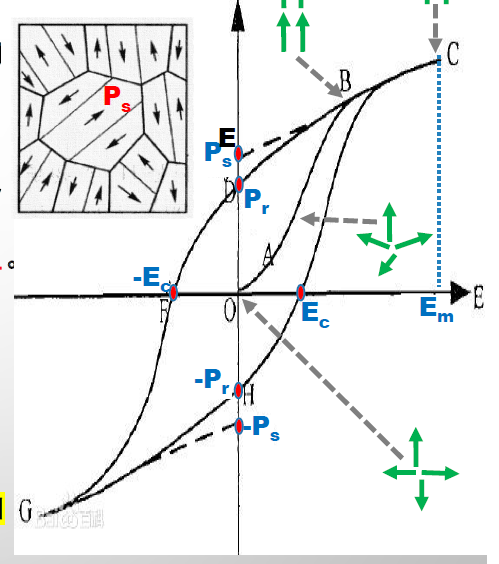

OA段：可能有新畴产生

AB段：晶体逐渐成为一个单一的极化畴

BC段：铁电体像线性介质一样依靠线性位移极化使得极化强度增加

EC：矫顽场

Pr：剩余极化强度

PS：自发极化强度

## 第八章 材料结构与光学性能

### 一、折射、反射、吸收、散射、透射，及其影响因素

#### 1、折射

- **（1）折射率与折射定律**

- **（2）折射率的色散：表征折射率随入射光波长的变化**

波长短的光焦距短

- **（3）影响折射率的因素**

构成材料的离子半径：

与极化现象有关

随离子半径增大而增大（回顾离子位移极化）（理解：有定性结论）

大离子可制成高折射率材料

离子的排列情况：

均质材料（非晶态或立方晶体）：各向同性

非均质材料（除立方以外晶型）

光射入后分为电矢量振动方向互相垂直且传播速度不等的两个波常光（o光）和非常光（e光）

O光服从折射定律，有折射率no；e光不服从折射定律，有折射率ne

出现双折射现象：光线进入光学各向异性介质后产生两条折射光线（o光和e光）的现象

特殊方向（称光轴）上不发生双折射

#### 2、反射

- **（1）能量关系**

由Fresnel公式，可有：

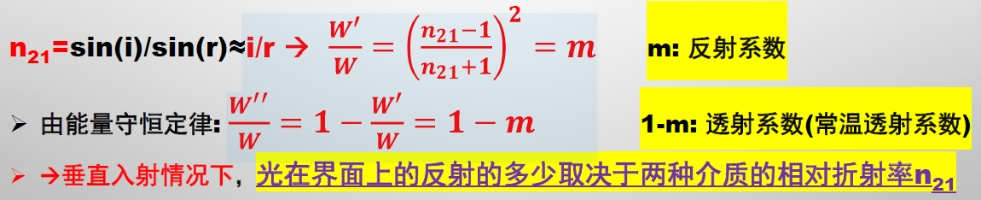

- **（2）镜面反射和漫反射**

#### 3、吸收

- **（1）一般规律：光在穿过介质的时候引起价电子跃迁或影响原子振动而失去能量**

- **（2）光吸收模型**

Lambert定律：

呈指数衰减

- **（3）与波长关系：为了获得较宽的透明范围，应具有较高的电子能隙值（减少跃迁）、弱原子间结合力和大离子质量（减少振动）**

- **（4）光的散射**

含义：光通过不均匀介质时一部分光偏离原方向传播的现象

分类：

频率不变：丁达尔散射、瑞利散射

频率改变：拉曼散射、康普顿散射

散射规律：

S：散射系数

- **（5）散射系数的影响因素**

材料宏观和微观缺陷：

内部的缺陷的折射率可能与主晶相不同，由此形成相对折射率，发生反射从而造成散射（例：气孔）

晶粒排列方向：

若不为各向同性，存在双折射问题

晶粒间取向不一定一致，可能产生相对折射率，造成散射

对于多晶无机材料，主要因素为双折射率

#### 4、透射

- **（1）含义**

透光性是个综合指标，即光能通过材料后，剩余光能量（强度）占入射光能量（强度）的百分比

- **（2）规律**

即为先前的综合

- **（3）影响因素及改进措施**

提高禁带宽度、提高原材料纯度，掺入外加剂以降低气孔，工艺措施

### 二、了解材料的呈色机制

#### 1、原子中电子激发跃迁：颜色反应、燃烧

#### 2、分子振动

#### 3、配位场中过渡金属能级变化：宝石、矿石、涂料、颜料等

#### 4、共轭效应和有机染料

#### 5、电荷转移效应和颜料

#### 6、电子在固体能带中跃迁

#### 7、结构色

### 三、发光的定义

#### 1、发光：物质吸收能量激发后以可见光形式放出能量

#### 2、荧光：物质在受激发时发光且激发源撤去后发光停止

#### 3、磷光：激发源撤去后仍能持续发光

### 四、理解发光中心

#### 1、发光中心：适当激发条件下，固体中产生发光的微粒

#### 2、分立发光中心

- **（1）含义：被激发的电子未离开发光中心，而是回到基态产生发光**

- **（2）特点：发光特性取决于发光中心本身，基质晶格影响为其次的**

- **（3）稀土离子**

作为激活剂或基质材料

具有不同的电子跃迁基质及丰富的能级跃迁

可通过调控稀土的价态调节发光材料的功能和特性

- **（4）过渡金属离子**

- **（5）红宝石发光器**

材料：刚玉（alpha-氧化铝）

原理：通过反射不断激发出相同频率、相位、偏振、波矢的光子

#### 3、复合放光中心

- **（1）含义：被激发的电子进入导带，与空穴复合而发光**

- **（2）特点：伴随着光电导，受基质晶格影响**

- **（3）能带理论**

光学跃迁发生在价带顶和导带底附近

直接带隙半导体：只需要吸收能量

间接带隙半导体：需要吸收能量并改变动量，有声子参与

- **（4）发光二极管原理：电子和空穴复合发光**

### 五、了解为什么用稀土元素、过渡金属元素发光：见上

### 六、红宝石激光器：见上

---

# 第二部分 · 表面、界面与前沿专题

## 2.1化学键与结构基础

### 一、有机和聚合物的力学状态和热转变

#### 1、温度形变曲线（热机械曲线）

非晶试样，加一恒力，观察试样发生形变与温度的关系

#### 2、现象

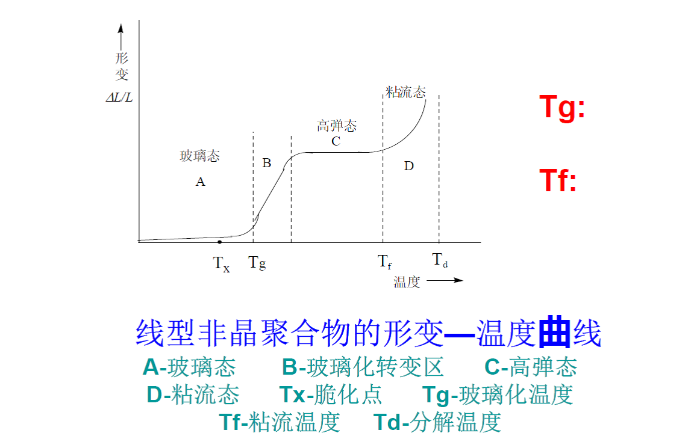

其中，脆化点：聚合物当温度降低至不能产生强迫高弹性，而呈玻璃态，同时高弹性消失，产生脆性断裂的临界温度

#### 3、微观解释

玻璃态：分子和链段运动冻结，只有键长和键角有微小变化

高弹态：链段运动被激发，通过主链旋转，甚至有部分链段滑移

粘流态：整个分子链相互滑动，粘流运动

## 2.2表面界面基础

### 一、表面界面概论

#### 1、含义

界面：非均匀体系必然存在两性质不同的相，两相共存必然有界面

表面：固体或液体与其饱和蒸气压之间的界面

### 二、表面界面结构

#### 1、表面原子与内部原子的差别

受力不同，经过4-6个原子层后，排列与体内的相当接近

实际清洁表面范围：4-6个原子层

#### 2、清洁表面的原子排列

- **（0）成因：**

排列中断，键变化、体系自由能增大。为降低能量需要对原子排列进行调整（自行调整或靠外来因素）

- **（1）弛豫**

含义：表面偏离晶格常数（压缩或膨胀）而晶胞结构不变

特点：

发生在垂直方向，仍然有平移对称性；

离子晶体表面容易发生弛豫；

会产生电偶极子

- **（2）重构**

含义：表面原子排列有较大幅度的调整，与衬底晶面原子的平移对称性有明显不同（水平方向的周期性不同于体内）

分类：

表面晶面与体内完全不一样

表面晶胞尺寸大于体内（晶格常数增大）

- **（3）台阶表面**

含义：表面由规则或不规则台阶组成

- **（4）表面吸附**

含义：体内扩散到表面的杂质和表面周围空间吸附的杂质所构成的表面

吸附位置：填充吸附、中心吸附、顶吸附、桥吸附

- **（5）表面偏析**

含义：混合组分材料中某一组分在自由表面或界面富集

实例：石墨烯偏析

### 三、表面界面成分

#### 1、金属表面成分

- **（1）一般特征：金属/过渡层/空气、金属/空气（少见）**

- **（2）过渡层组成**

氧化物（最常见）、氮化物、硫化物、尘埃、油脂、吸附气体等

#### 2、合金表面成分

- **（1）一般特征：金属/过渡层/空气，较为复杂**

#### 3、氧化物表面成分

- **（1）一般特征：空气/非化学计量层/氧化物**

- **（2）特点**

由于表面缺陷，容易形成氧空位，从而形成非化学计量层

氧化物表面有极性，会吸附

初生的氧化物表面：活泼，会吸附水分子解离成羟基，表面物理化学性质有显著不同

#### 4、复杂薄膜材料表面成分：略

### 四、相界

#### 1、含义：热力学平衡条件下，不同相之间的交界区

#### 2、分类

- **（1）共格相界：两相具有相同或相似的晶格结构，晶格常数比较接近**

- **（2）准共格相界：两相具有相同或相似的晶体结构,，晶格常数差别小于10％**

若晶格常数差距较大，弹性畸变会较严重，失去准共格特征

- **（3）非共格相界：各相的晶格结构和晶格常数相差较多**

### 五、晶界

#### 1、含义：多晶材料中晶粒间的交界过渡区称晶粒间界

#### 2、分类

- **（1）原子堆积排列层错**

- **（2）双晶界面**

分为：共格双晶界（看作是形成了类似的晶胞结构）和非宫格双晶界

- **（3）小角度晶界**

晶界角小于10度

- **（4）大角度晶界**

晶界角大于10度

#### 3、特征

- **（1）多晶体中的晶界大都是大角度晶界**

- **（2）为了尽可能形成低能晶界，在晶界过渡区中尽可能通过原子排列来过渡**

- **（3）结构与能量：晶界结构疏松，原子排列紊乱，能量高，产生晶界能**

- **（4）杂质偏聚：杂质原子易在晶界聚集产生内吸附**

- **（5）原子扩散：晶界原子能量高、缺陷多，扩散速度比晶粒内部快**

- **（6）性能影响：晶界杂质偏析对晶体耐蚀性、蠕脆性、电学性能等关键性质起重要作用**

#### 4、晶界异组成存在方式

- **（1）晶界偏析层**

- **（2）层状析出物**

- **（3）粒状析出物**

#### 5、金属氢脆类型：沿晶开裂、穿晶开裂

### 六、超微粒子与纳米材料表面

#### 1、表面效应

随微粒尺寸减小，表面原子数比例增加，表面能也迅速增加（来自于表面原子百分比和堆积缺陷）

### 七、表面处理

#### 1、表面改性（钝化方法）：氢覆盖、甲基覆盖

#### 2、抛光与金属表面结构

- **（1）贝尔比层**

含义：研磨抛光后最表面层以非晶态存在

成因：研磨过程中部分原子熔化，未回到平衡位置，造成畸变

- **（2）抛光与材料表面改性**

金属：希望表面形成贝尔比层

陶瓷：抛光可消除表面较大的缺陷

半导体：抛光后表面会形成一定缺陷区，需要去除

### 八、摩擦

#### 1、真实接触面积与表观接触面积

两个不平整表面相互接触时，真实接触面积与表观接触面积差别较大

在实际应用中，真实接触面积会随受力负荷而改变

## 2.3表面张力和表面润湿

### 一、表面张力

#### 1、实例

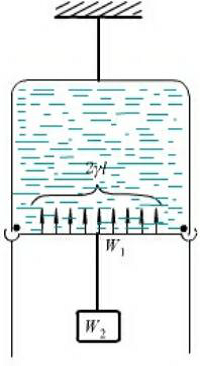

由于膜有两个面，故

#### 2、表面张力与表面自由能

做的元功，即

可视作表面自由能，简称表面能（理解：看量纲）

#### 3、微观模型：表面由分子和空位组成

#### 4、影响大小之因素

- **（1）温度**

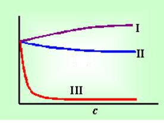

I：强电解质和多羟基化合物溶液（理解：相互作用力大）

II：与溶剂间相互作用力较弱的极性小分子溶液（理解：相互作用力小）

III：低浓度表面活性剂溶液（理解：降低相互作用力）

- **（2）表面吸附**

负吸附：溶质表层浓度小于体相浓度

正吸附：大于

- **（3）表面活性剂降低表面张力**

### 二、Laplace公式

#### 1、一般

#### 2、特殊（对球面）

### 三、表面汽蚀与纳米气泡

#### 1、汽蚀现象：略

#### 2、纳米气泡由来

#### 3、制备方法：醇水替换法、直接滴加法、电解法

#### 4、形貌与分布：略

#### 5、对固液界面影响：对界面有活化作用，可促进某些反应进行

#### 6、应用例：略

### 四、表面润湿

#### 1、含义：固液接触时，体系的自由能降低

#### 2、分类

沾湿（粘附润湿）：液体直接接触固体，将气液界面和气固界面变为固液界面的过程

浸湿：将固体完全浸入到液体中，固体表面均为液体所置换的过程为浸湿

铺展：液体与固体表面接触后，在固体表面上排除空气而自行铺展的过程

#### 3、接触角与润湿角：略

#### 4、杨氏方程

用来描述固液之间的粘附功和接触角

## 2.4表面电现象和双电层

### 一、界面电现象

#### 1、含义

- **（1）界面电势差：不同相接触时，相界面上由于电子、离子在两相之间的转移或偶极子的选择性定向，使得相界面出现带电现象，造成两相之间的电势差**

- **（2）界面双电层：在固液界面处，固体表面和附近的液体内通常分别带有电性相反、电量相等的离子层，形成双电层**

#### 2、界面带电原因

- **（1）两相对离子、电子亲和力不同**

- **（2）表面电离或表面基团的离子化**

- **（3）晶格取代或缺陷对带电粒子的俘获**

### 二、扩散双电层

#### 1、含义

固体表面带电以后，由于静电吸引，固体表面的电荷吸引溶液中带相反电荷的离子，使其向固体表面靠拢被静电吸引的、带相反电荷的离子称为反离子。反离子仍然处在溶液中，距离固体表面一定距离，构成双电层

#### 2、理论模型：Helmholtz平行板电容器模型、扩散双电层模型（结论：反离子呈扩散平衡分布）、Stern对扩散双电层的发展、Grahame模型

#### 3、意义：略

### 三、胶体体系

#### 1、含义：略

#### 2、特点

大比表面积和高表面能

能稳定一段时间

加入盐类可聚沉

#### 3、胶体的聚沉

- **（1）胶体粒子带有电荷时，周围为离子氛**

- **（2）粒子靠近时，离子氛重叠，斥力阻碍粒子聚集沉降**

- **（3）外加粒子能压缩双电层厚度，降低电势，减少粒子静电斥力**

- **（4）起聚沉作用的主要为反离子，反离子价越高、效率越高，聚沉值与价数六次方成正比，浓度也会影响聚沉值**

## 2.5表面缺陷和缺陷反应方程式

### 一、晶体结构缺陷

#### 1、按几何形态

- **（1）点缺陷**

空位

间隙质点

杂质质点

色心：对可见光产生选择性吸收的缺陷部位，能形成颜色

与材料性能的关系：电学性质、光学性质、热学性质、高温动力学过程

- **（2）线缺陷**

各种位错

线缺陷的产生和运动与材料的韧性、脆性密切相关

- **（3）面缺陷**

晶界、表面、堆积层错等

与材料的断裂韧性有关

- **（4）体缺陷**

第二相粒子团、空位团

与材料的分相、偏聚有关

#### 2、按产生原因

- **（1）热缺陷（本征缺陷）**

Frenkel：空位和间隙质点对

Schottky：只有空隙，体积增加

- **（2）杂质缺陷**

- **（3）非化学计量缺陷：基质晶体和介质中某些组分发生交换**

- **（4）电荷缺陷：出现电子、空穴等**

- **（5）辐照缺陷**

### 二、缺陷的符号表示

## 2.6熔体、玻璃和非晶材料

### 一、液体

#### 1、物态：略

#### 2、液体的黏度

影响黏度的主要因素：温度、化学组成

#### 3、液体的结构理论：近程有序、长程无序

### 二、熔体

#### 1、熔体概论

- **（1）含义：熔融物质、熔融材料**

- **（2）盐类熔体结构单元：分子、原子、离子**

- **（3）硅酸盐熔体：不能全部以简单离子形式存在，有聚合物**

#### 2、熔体聚合物理论

- **（0）含义：熔体由各种聚合程度不同的聚合体随机混合而成；在一定条件下，“聚合-解聚”达到平衡；聚合体的种类、大小和数量随熔体的组成和温度而变化**

- **（1）形成过程**

初期：硅酸盐的解聚（分化）

中期：解聚伴随缩聚

后期：解聚缩聚平衡

熔体成分：低聚物、高聚物、三维晶格碎片、游离碱吸附物等

- **（2）分化过程**

硅氧四面体网架结构断裂

从表面开始

伴随复杂碰撞和离子交换

- **（3）浓度：组成不变，温度上升则低聚物浓度增加（理解：温度上升，高聚物易解聚）**

#### 3、熔体黏度

高温区和低温区和看作是具有线性关系

#### 4、熔体表面张力

### 三、玻璃

#### 1、形成

通性：各向同性、介稳性、熔融态向玻璃态转变是可逆和渐变的且物理化学性质做连续变化

#### 2、结构

- **（1）微晶学说：玻璃由极微小晶体组成**

- **（2）无规则网络学说：玻璃是由三维空间网络构筑成的**

#### 3、玻璃强度

影响因素：宏观和微观缺陷、微裂纹

#### 4、表面处理和增强

- **（1）快速风冷钢化法**

- **（2）低温离子交换钢化**

- **（3）失效模式**

硫化镍结石晶相转化

钢化过度、表面应力过大

钢化玻璃不同区域应力不一致

缺陷

### 四、非晶材料

#### 1、含义

#### 2、非晶态物质

非晶态物质泛指原子排列没有周期性的任何固体

玻璃一般指由熔体淬火得到的非晶态物质

包含关系

#### 3、非晶态固体特点

- **（1）非晶物质普遍存在**

- **（2）非晶的结构、特征和性能与时间相关**

- **（3）非晶物质是很复杂的原子无序堆积的凝聚态物质，是多体相互作用体系**

- **（4）原子尺度和纳米尺度局域特性的重要性：不同区域差别很大**

#### 4、非晶合金的不均匀性

- **（1）含义：静态结构的不均匀性、结构动力学的不均匀性**

- **（2）结构的不均匀性：各种模型**

- **（3）化学元素的不均匀性**

- **（4）动态不均匀性**

#### 5、材料的应力响应

## 2.7碳纤维与复合材料

### 一、碳纤维概论

#### 1、含义：纤维状碳素材料，含碳量大于90%

#### 2、分类

按力学性能：通用级、高性能

按丝束大小：大丝束（48-480K）、小丝束（1-24K）

注：1K：一条纤维含1000根单丝

### 二、PAN基碳纤维生产

#### 1、概论

PAN：聚丙烯晴

PAN基碳纤维的意义：强度好、产量高

生产中每一步的缺陷都会遗传到下一步

#### 2、生产工艺

- **（1）概论**

制备PAN纺丝液、纺丝、预氧化及碳化

- **（2）预氧化**

过程复杂

氧驱动脱氢反应

优化条件可以制备高强度和高模量碳纤维

- **（3）碳化**

碳化温度影响性能

1500度时强度达到最大

#### 3、表面处理方法

氧化法、涂层法、等离子体处理法、能量束处理法、多巴胺（或金属离子）处理法

### 三、碳纤维的结构

#### 1、碳纤维的皮芯结构

- **（1）概论**

皮层和芯层结构上差异很大

皮层结构较致密、分子链取向程度较高，芯层取向度低

皮芯结构影响碳纤维性能和结构的径向均一化

- **（2）皮芯结构的形成**

纺丝：双扩散（传质和传热）

预氧化：得到加强（该过程也是双扩散）

- **（3）整体结构**

沿轴向的乱层石墨微晶和微空洞的二相体系

微孔洞：堆积不完美的结果

### 四、复合材料概论：略

### 五、复合材料的表面与界面

#### 1、纤维增强机理

利用二者的复合作用，使得断纤维能承受应力、树脂与纤维的粘结能抑制裂纹传播

#### 2、界面形成理论

浸润理论、机械作用理论、化学键理论

## 2.8陶瓷与烧结过程

### 一、陶瓷与烧结概论

#### 1、传统陶瓷和先进陶瓷

传统陶瓷：使用天然硅酸盐矿物作为原料经烧结制成

先进陶瓷：采用纯度较高的人工合成化合物作为原料经结构设计、特定成型方法、烧结制成

#### 2、烧结：将成型的粉体在低于熔点的温度和特定的条件下进行烧结

区别于烧成：烧成是将原料烧成制品的全过程，包含原料脱水等前置步骤

区别于熔融：熔融过程中全部为液相

### 二、烧结理论

#### 1、烧结体组成：晶相、玻璃相、晶界、气孔、杂质、缺陷、微裂纹

#### 2、烧结的推动力

粉体比表面积较大，表面能较高，体系趋向于使得表面能降低的方向

表面能降低是推动力，外加能量是助推

#### 3、烧结阶段

初期：颗粒重排、粘合，空隙变形缩小，固体气体总表面积无变化

中期：开始传质，空隙进一步变形缩小，形成联通的隧道

后期：传质继续进行，气孔变成孤立的闭合气孔

#### 4、烧结机制：颗粒的粘附+传质

#### 5、传质

- **（1）流动传质：**

粘性流动传质：液相多、牛顿流体，表面张力下定向动

塑性流动传质：液相少、非牛顿流体，表面张力下以整排原子的运动或滑移来传质

- **（2）扩散传质：浓度梯度推动**

- **（3）气相传质：物质容易在高能处蒸发在低能处凝结**

- **（4）溶解-沉淀传质：细小颗粒表面能大、溶解度高，溶解后在大颗粒表面沉淀析出**

#### 6、固相烧结：过程同上，有初期中期后期

### 三、陶瓷组织结构

#### 1、晶界迁移和晶界扩散

#### 2、微观组织结构

有晶相、玻璃相、晶界、气孔、杂质、微裂纹、缺陷

传统陶瓷因为光会散射、反射、折射、吸收而不透明

### 四、纳米陶瓷

#### 1、含义：晶粒、晶界、第二相在纳米尺度

#### 2、烧结技术

- **（0）关键：抑制晶粒长大**

- **（1）常规烧结：需要烧结助剂以降低温度，添加第二相降低晶界迁移速率、增加晶界扩散**

- **（2）快速烧结：快速升温以跳过表面扩散，直接进入高温烧结，提高致密化程度，抑制晶粒生长速率**

- **（3）两步烧结法：在高温下快速烧结以达到一定的致密度，后快速降温以使得完全致密化**

## 2.9表面工程与表面技术

### 一、柔性材料的制备

#### 1、设计原理：加入波纹

#### 2、可拉伸无机电子材料

可延伸纳米带状物：在一维尺度上可延展

可延展薄膜：在二维尺度上可延展

### 二、软印刷技术

#### 1、含义：基于弹性体印章来转移图形结构的微纳加工技术

#### 2、工艺过程：制备弹性体印章，用印章转移特定的图形结构到基片表面

#### 3、制备弹性体印章

- **（1）母版制备**

传统技术：光刻、电子束蚀刻

非传统技术：高能激光束制备、超精密机械刻画、自组织和自组装

- **（2）实例：PDMS印章的制备工艺流程**

含义：PDMS，聚二甲基硅氧烷

流程：将主剂和固化剂均匀混合浇铸到母版上，热固化或光固化，剥离

PDMS优势：弹性体、化学惰性、各向同性均匀体、透明

#### 4、微接触印刷

常用墨水：烷基硫醇分子、硅烷分子、纳米颗粒

常用基片、贵金属、半导体、氧化物、透明导电材料

### 三、仿生柱状黏附材料

#### 1、对材料的要求

能在固体表面牢固附着、能和固体表面快速分离

#### 2、黏附机理：范德华力、静电力等

#### 3、柱状黏附材料

- **（1）选用材料：PDMS（聚二甲基硅氧烷）等**

- **（2）末端结构：抹刀型、蘑菇型较优**

- **（3）制备方法：直接塑造、后期处理形成**

#### 4、未来发展：具有对于刺激的响应性

### 四、小尺度界面工程

#### 1、纳米岛限域催化剂

将孤立且有缺陷的CeOx纳米岛嫁接到高比表面积的二氧化硅上，然后让每个纳米岛各自吸附一个Pt原子作为催化剂

#### 2、界面构造催化剂

#### 3、制备均匀手性碳纳米管有序膜
